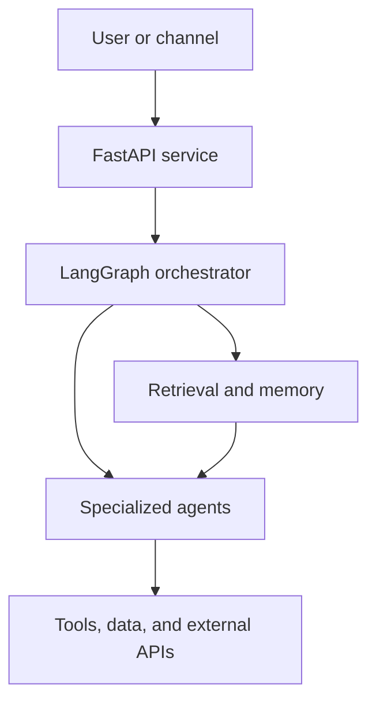

<h1 align="center">Hassan Daud</h1>

  <strong>Software Engineer · AI Agents · RAG · LLM Applications</strong>

  Building AI systems that can retrieve knowledge, maintain context, coordinate specialized agents, and take action.

  
  
  

---

### About me

I am a **Software Engineer at OCloud Solutions** focused on turning generative AI ideas into working applications. My experience spans **LangGraph agent orchestration, retrieval-augmented generation (RAG), conversational memory, and production backend services**. I work primarily with Python and FastAPI, connecting LLMs to data, tools, and real user workflows.

I graduated with a **BS in Computer Science from PUCIT in 2025**. I also served as a Machine Learning Teaching Assistant, helping students with algorithms, Python implementations, and model evaluation.

**Current interests:** reliable AI agents, multi-agent systems, LLM reasoning, memory-augmented applications, NLP, and human–AI interaction.

### What I build

- **Agentic workflows:** specialized agents, graph-based routing, tool use, and structured outputs.
- **RAG and memory:** vector search, external knowledge retrieval, persistent context, and personalized conversations.
- **Applied LLM systems:** conversational assistants, natural-language-to-SQL workflows, and enterprise integrations.
- **AI backends:** FastAPI services, PostgreSQL data models, API integrations, and deployment with Docker.

### Selected AI work

| Project | What I built | Stack |
| --- | --- | --- |
| **Multi-Channel Real Estate AI Agent System** | A conversational platform for SMS, Instagram, and website interactions. A LangGraph orchestrator routes requests to specialized workflows for lead response and listing search; the assistant supports qualification, recommendations, showing requests, and OTP verification. | Python · FastAPI · LangGraph · PostgreSQL · Pinecone · Twilio |
| **MemoryGraph AI** | A multi-user assistant with persistent memory, stateful conversations, vector-based retrieval, and LangSmith tracing for debugging agent workflows. | Python · FastAPI · LangGraph · LangChain · PostgreSQL · Pinecone · LangSmith |
| **Visualization AI** | A natural-language interface to enterprise data, using LLM-generated SQL and conversational context to support follow-up analytics questions. | Python · FastAPI · LangChain · PostgreSQL · OpenAI |
| **Enterprise Real Estate AI Agent** | Specialized customer-support agents, routing, topics, and actions built with Salesforce Agentforce. | Salesforce Agentforce · Generative AI · Prompt Engineering |

### Public projects

- **[LangGraph Chatbot](https://github.com/hassandaudhi/LANGGRAPH-CHATBOT)** — A conversational AI project built around graph-based chatbot workflows.
- **[Contract Compliance Workflow System](https://github.com/hassandaudhi/CONTRACT-COMPLIANCE-WORKFLOW-SYSTEM)** — An AI-focused workflow project for contract review and compliance tasks.
- **[Study Companion](https://github.com/hassandaudhi/Study-Companion)** — An AI learning companion designed to support study and question answering.
- **[Designify: AI-driven 3D T-shirt customization](https://github.com/HassanDaud/Designify)** — My university project for AI-assisted design generation, product customization, and a RAG-based product assistant.
- **[PDFChat: chat with your documents](https://github.com/hassandaudhi/PDFChat)** — A Flask-based application for asking questions about uploaded PDF files with an LLM.

### Tools I use

| Area | Technologies |
| --- | --- |
| **Languages** | Python, JavaScript, SQL, C++ |
| **Agents and LLMs** | LangGraph, LangChain, OpenAI API, Google Gemini API, Amazon Bedrock, Salesforce Agentforce, LangSmith |
| **Retrieval and data** | PostgreSQL, Pinecone, FAISS, ChromaDB, vector search |
| **Backend and delivery** | FastAPI, Flask, REST APIs, Docker, Git, GitHub |

  
  
  
  
  
  

### Education and credentials

- **BS Computer Science**, Punjab University College of Information Technology (PUCIT), 2025 · **CGPA 3.45/4.00**
- [Oracle Cloud Infrastructure 2025 Certified Generative AI Professional](https://catalog-education.oracle.com/ords/certview/sharebadge?id=1C628FBE0544FFFB27DD3355BC44FC7E9131FE59EF01F042E0E904A2F32154B0)
- [Oracle Cloud Infrastructure 2025 Certified AI Foundations Associate](https://catalog-education.oracle.com/ords/certview/sharebadge?id=2E1D63CF3D89A292CD9349E368D77CE1DAD8A862E749C68A099BD29F06377194)
- [Machine Learning Specialization](https://www.coursera.org/account/accomplishments/specialization/ZH8V6KX6VHID)

### Let's connect

I enjoy discussing practical AI systems, agent architecture, RAG, and research ideas. Reach me by [email](mailto:hd0789529@gmail.com) or connect on [LinkedIn](https://www.linkedin.com/in/hassan-daud-291465264/).
